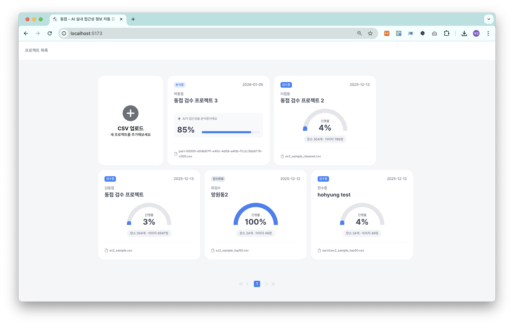
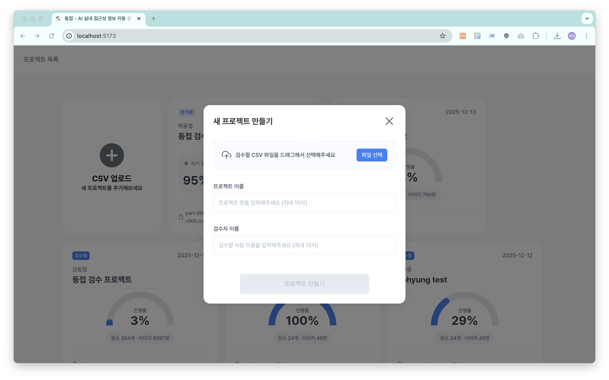
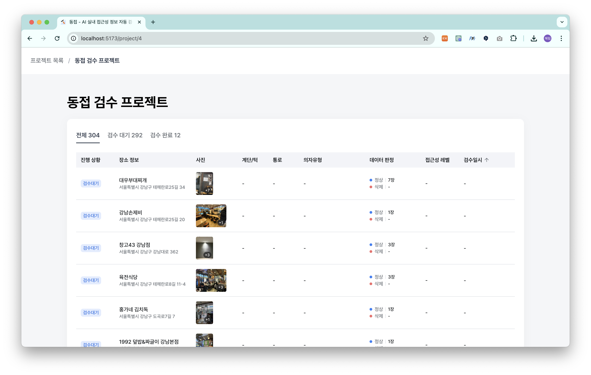
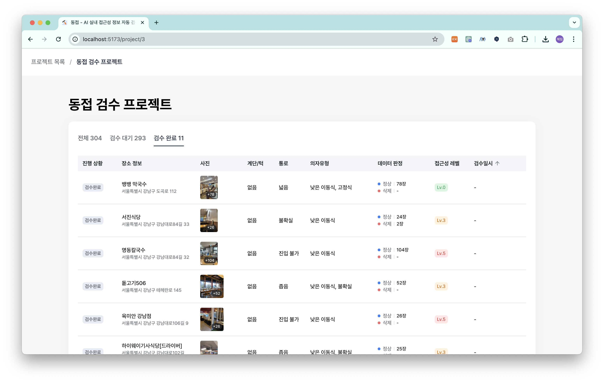
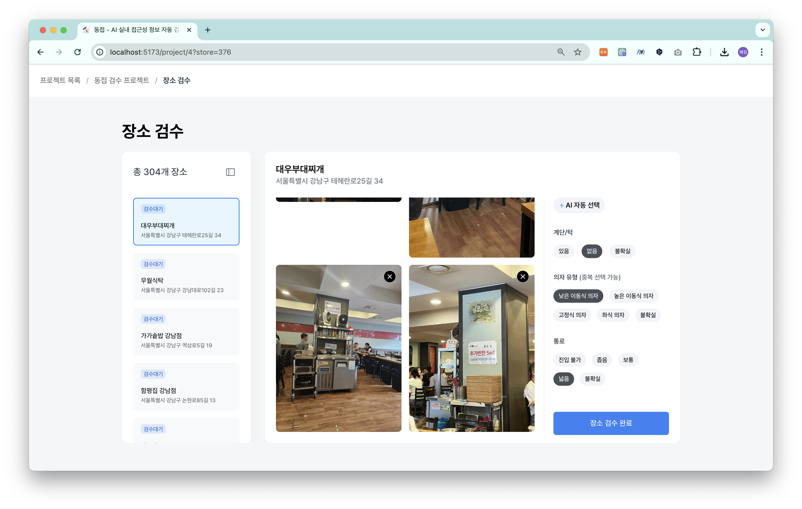

# [테크포임팩트 2기] 동접 LAB

> **『동접』은 이동약자와 비이동약자 모두가 동등한 접근성을 가지길 바라는 마음으로 지어졌습니다.**<br/>
모든 장소의 물리적·환경적 접근성을 완벽하게 해결하는 데에는 한계가 있지만, **정보에 대한 접근성만큼은 누구에게나 공평하고 정확하게 제공**하고자 합니다.

> 본 서비스는 [카카오임팩트](https://www.kakaoimpact.org/)와 [계단뿌셔클럽](https://staircrusher.club/)의 지원, [테크포임팩트](https://techforimpact.io/) 커뮤니티의 기여로 개발되었습니다.

## ♿️ 서비스 개요
<!-- POSTER -->
<div align="center">
  <table>
    <tr>
      <td align="center">
        
      </td>
      <td align="center">
        
      </td>
    </tr>
  </table>
</div>

LAB 내에서 개발한 **실내 접근성 분석 AI 모델**을 실제 운영 환경에 적용한 **실내 접근성 정보 자동 검수 플랫폼**입니다.

장소별 사진 데이터로부터 접근성 정보를 추출하고, 검수자는 AI가 제시한 초기값을 검토·수정하는 방식으로 빠르고 정확한 검수 작업을 진행할 수 있습니다.

- 🧠 AI 기반 실내 접근성 자동 분석
  - 실내 환경 요소(계단·턱 유무, 통로 너비, 의자 유형) 자동 판별
- ✔️ 검수 효율 향상
  - 초기 판단값을 제시해 검수자의 직접 수정 범위를 최소화
  - 반복 작업 부담 감소 및 일관된 기준 유지
- 🔄 운영 시스템과의 자연스러운 연계
  - CSV 형식으로 데이터 업로드
  - 검수 완료 데이터 JSON Export 지원

> 구글 시트에 수기로 정리하던 기존 검수 워크플로우를<br/>
**CSV 업로드 → 자동 분석 → 검수 진행 → JSON Export** 체계로 전환하여, 운영 효율과 데이터 활용성을 향상시켰습니다.

## ✨ 주요 기능

### 🗂️ 프로젝트 대시보드

<div align="center">
  <table>
    <tr>
      <td align="center">
        
      </td>
      <td align="center">
        
      </td>
      <td align="center">
        
      </td>
    </tr>
  </table>
</div>

- CSV 파일 업로드로 데이터 일괄 등록
- 프로젝트별 분석 현황 확인 (AI 분석 중 / 검수 진행 중 / 검수 완료)

### 📋 프로젝트 내부 검수 목록

<div align="center">
  <table>
    <tr>
      <td align="center">
        
      </td>
      <td align="center">
        
      </td>
    </tr>
  </table>
</div>

- 장소별 검수 상태 확인 (검수 대기 / 검수 완료)
- 분석 결과 요약 및 접근성 수준 표시

### 📸 장소 검수

<div align="center">
  <table>
    <tr>
      <td align="center">
        
      </td>
      <td align="center">
        
      </td>
    </tr>
  </table>
</div>

- 한 장소의 여러 이미지에서 추출한 접근성 정보 확인
- AI 분석 결과를 초기값으로 제공, 검수자는 필요 시만 수정

<!-- ### 📤 Export -->

<!-- TODO: add screenshots -->
<!-- <div align="center">
  <table>
    <tr>
      <td align="center">
        
      </td>
      <td align="center">
        
      </td>
      <td align="center">
        
      </td>
    </tr>
  </table>
</div> -->

<!-- - 검수 완료 데이터를 JSON 형식으로 다운로드 -->

## 🛠️ 기술 스택

- **Core** : React 19, TypeScript, React Router 7
- **State Management** : TanStack Query 5
- **Styling & UI Components** : PandaCSS, Radix UI
- **HTTP Client & Mock**: Axios, MSW (Mock Service Worker)
- **Dev Tools & Linting**: Vite, ESLint, Prettier

<!-- ## 📊 시스템 아키텍쳐-->
<!-- TODO: 시스템 아키텍쳐추가 -->

<!-- ## 📊 시퀀스 다이어그램 -->
<!-- TODO: 시퀀스 다이어그램 추가 -->

## 📁 프로젝트 구조

**콜로케이션(Colocation) 패턴**을 사용해 기능별로 관련 파일을 한 곳에 모아 관리했습니다.

```bash
dongjeop-front-v2/
├── .github/                    # GitHub 설정 (GitHub Actions CI/CD, 이슈/PR 템플릿)
├── public/                     # 정적 파일
├── src/
│   ├── assets/                 # import용 SVG 아이콘
│   │
│   ├── components/             # 전역 재사용 컴포넌트
│   │   ├── async-boundary.tsx  # 비동기 처리 래퍼
│   │   ├── error-boundary.tsx  # 에러 바운더리
│   │   ├── badge.tsx
│   │   ├── button.tsx
│   │   ├── modal.tsx
│   │   └── ...
│   │
│   ├── contexts/               # React Context
│   │   └── toast.tsx           # 토스트 알림 Provider
│   │
│   ├── hooks/                  # 전역 Custom Hooks
│   │   ├── use-click-outside.ts
│   │   └── use-toast.tsx
│   │
│   ├── lib/                    # 공통 유틸리티 및 설정
│   │   ├── api-client.ts       # Axios 인스턴스
│   │   ├── api-error.ts        # API 에러 처리
│   │   ├── query-client.ts     # Tanstack Query 설정
│   │   ├── query-hooks.ts      # Query 공통 훅
│   │   └── query-provider.tsx  # Query Provider
│   │
│   ├── mocks/                  # MSW 모킹
│   │   ├── handlers/           # API 핸들러
│   │   ├── browser.ts          # 브라우저 워커
│   │   └── node.ts             # Node 워커
│   │
│   ├── pages/                  # 페이지 (라우트별 구성)
│   │   │
│   │   ├── dashboard/          # 대시보드 페이지
│   │   │   ├── _apis/          # 페이지 전용 API 함수
│   │   │   ├── _components/    # 페이지 전용 컴포넌트
│   │   │   ├── _hooks/         # 페이지 전용 훅
│   │   │   ├── _queries/       # 페이지 전용 Query 키/옵션
│   │   │   ├── _types/         # 페이지 전용 타입
│   │   │   └── index.tsx       # /
│   │   │
│   │   └── project/            # 프로젝트 상세 페이지
│   │       ├── _apis/          # 페이지 전용 API 함수
│   │       ├── _components/    # 페이지 전용 컴포넌트
│   │       │   ├── project-detail-view.tsx      # 장소 목록 화면 (/project/:id)
│   │       │   ├── store-review-view.tsx        # 장소 검수 화면 (?store=:id)
│   │       │   ├── store-review-content.tsx     # 장소 검수 내부 컨텐츠
│   │       │   └── ...
│   │       ├── _hooks/         # 페이지 전용 훅
│   │       ├── _queries/       # 페이지 전용 Query 키/옵션
│   │       ├── _types/         # 페이지 전용 타입
│   │       ├── _utils/         # 페이지 전용 유틸
│   │       └── index.tsx       # /project/:id
│   │
│   ├── types/                  # 전역 TypeScript 타입
│   ├── layouts/                # 레이아웃 컴포넌트
│   ├── constants/              # 전역 상수
│   │
│   ├── routes.tsx              # React Router 설정
│   ├── main.tsx                # 앱 진입점
│   └── index.css               # 전역 스타일
│
├── styled-system/              # Panda CSS 생성 파일
│
├── vite.config.ts              # Vite 설정
├── tsconfig.json               # TypeScript 설정
├── panda.config.ts             # Panda CSS 설정
├── eslint.config.js            # ESLint 설정
├── package.json                # 의존성 관리
└── ...config files             # 기타 설정 파일
```

## 👥 팀원 소개

<div align="center">

| 양혜림 | 정유정 | 조재석 |
|:------:|:------:|:------:|
|  |  |  |
| FE | FE | FE |
| [GitHub](https://github.com/hyrmzz1) | [GitHub](https://github.com/dbwjd5864) | [GitHub](https://github.com/Pridesd) |

</div>